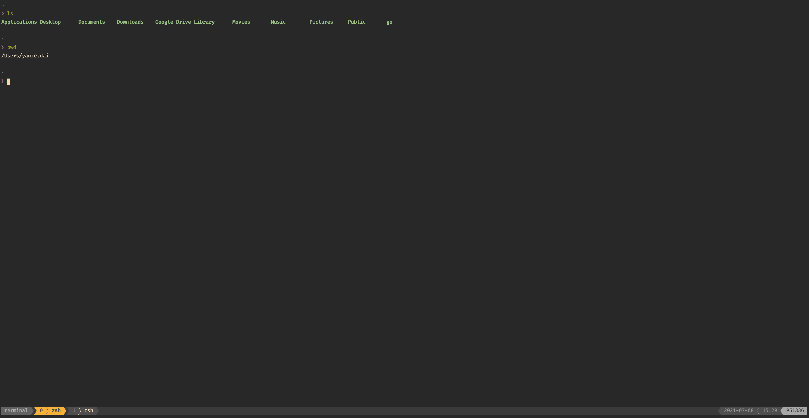
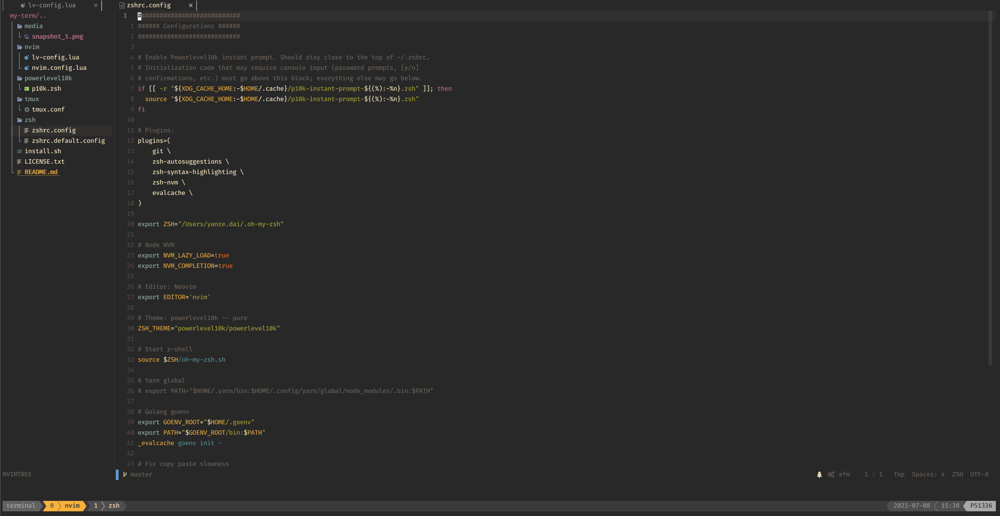

# My-term

My good-looking productive terminal environment integration for MacOS with an easy installation.

## Components

- Package Manager: [Homebrew](https://brew.sh)
- Editor: [Neovim (>= 0.7)](https://neovim.io)
- Editor Configuration: [NvChad](https://github.com/NvChad/NvChad)
- Shell: [Zsh](https://www.zsh.org) + [Oh-My-Zsh](https://ohmyz.sh)
- Shell Theme: [Powerlevel10k](https://github.com/romkatv/powerlevel10k) -- pure
- Multiplexer: [Tmux](https://github.com/tmux/tmux)

## Screenshots




## Installation

### Prerequisites

Make sure to install [Node.js](https://nodejs.org/) and [Golang](https://golang.org) before or after the installation. They are used by some plugins for handling debugging or formatting.

### One Command Install

This command will backup the existed config files. It will prompt for a sudo password during the installation.

```sh
bash <(curl -s https://raw.githubusercontent.com/daiyanze/my-term/master/install.sh)
```

### Manual Install

The manual installation may take some efforts, just be patient to execute each line below. This installation step assumes that you'd be installing "my-term" for the first time.

It's better to back up all of the related configuration files.

```sh
# Install Homebrew
$ /usr/bin/ruby -e "$(curl -fsSL https://raw.githubusercontent.com/Homebrew/install/master/install)"

# Install Oh My Zsh and it's plugins
$ sh -c "$(curl -fsSL https://raw.github.com/robbyrussell/oh-my-zsh/master/tools/install.sh)"

$ git clone https://github.com/zsh-users/zsh-syntax-highlighting.git ${ZSH_CUSTOM:-~/.oh-my-zsh/custom}/plugins/zsh-syntax-highlighting
$ git clone https://github.com/zsh-users/zsh-autosuggestions ${ZSH_CUSTOM:-~/.oh-my-zsh/custom}/plugins/zsh-autosuggestions
$ git clone --depth=1 https://github.com/romkatv/powerlevel10k.git ${ZSH_CUSTOM:-$HOME/.oh-my-zsh/custom}/themes/powerlevel10k
$ git clone https://github.com/mroth/evalcache ${ZSH_CUSTOM:-~/.oh-my-zsh/custom}/plugins/evalcache
$ git clone https://github.com/lukechilds/zsh-nvm ${ZSH_CUSTOM:-~/.oh-my-zsh/custom}/plugins/zsh-nvm

# Install Tmux plugin manager
$ git clone https://github.com/tmux-plugins/tpm $HOME/.tmux/plugins/tpm

# Install NvChad
$ git clone https://github.com/NvChad/NvChad ~/.config/nvim --depth 1 && nvim

# Clone this repo to ~/.config/my-term
$ git clone https://github.com/daiyanze/my-term $HOME/.config/my-term

# Setup symlink to the config files
$ ln -s -f $HOME/.config/my-term/zsh/zshrc.config $HOME/.zshrc
$ ln -s -f $HOME/.config/my-term/tmux/tmux.conf $HOME/.tmux.conf
$ ln -s -f $HOME/.config/my-term/nvim/chadrc.lua $HOME/.config/nvim/lua/custom/chadrc.lua
$ ln -s $HOME/.config/my-term/nvim/plugins/ $HOME/.config/nvim/lua/custom
$ ln -s $HOME/.config/my-term/nvim/core/ $HOME/.config/nvim/lua/custom
$ ln -s -f $HOME/.config/my-term/powerlevel10k/p10k.zsh $HOME/.p10k.zsh
```

### Uninstall

To remove the related configurations, simply use the shell script comes within the repo.

```sh
$ sh $HOME/.config/my-term/uninstall.sh
```

Or do it manually.

```sh
# NvChad
$ rm -rf $HOME/.config/nvim

# Oh my zsh
$ rm -rf $HOME/.oh-my-zsh

# Tmux
$ rm -rf $HOME/.tmux


# Symbolic Links
# NvChad
unlink $HOME/.config/nvim/lua/custom/chadrc.lua
unlink $HOME/.config/nvim/lua/custom

# Tmux 
unlink $HOME/.tmux.conf

# Power10k
unlink $HOME/.p10k.zsh

# Oh my zsh
unlink $HOME/.zshrc
```


## Customizations & Plugins for each of the "Components"

### Neovim

The Neovim version should be higher than 0.5 which can be installed with the [One Command Install](/#one-command-install).

The configuration is based on [NvChad](https://github.com/NvChad/NvChad). Added some personal favor customizations.

### Tmux

- [Tmux Plugin Manager](https://github.com/tmux-plugins/tpm): Helps manages the Tmux plugins
- [Tmux sensible](https://github.com/tmux-plugins/tmux-sensible): Basic Tmux settings everyone can agree on
- [Tmux pain control](https://github.com/tmux-plugins/tmux-pain-control): standard pane key-bindings for tmux
- [Tmux sessionist](https://github.com/tmux-plugins/tmux-sessionist): Persists tmux environment across system restarts.
- [Tmux resurrect](https://github.com/tmux-plugins/tmux-resurrect): Lightweight tmux utils for manipulating sessions
- [Tmux yank](https://github.com/tmux-plugins/tmux-yank): Copy texts to system clipboard
- [Tmux gruvbox](https://github.com/egel/tmux-gruvbox): A Custom theme (dark) enabled by default

## License

MIT
